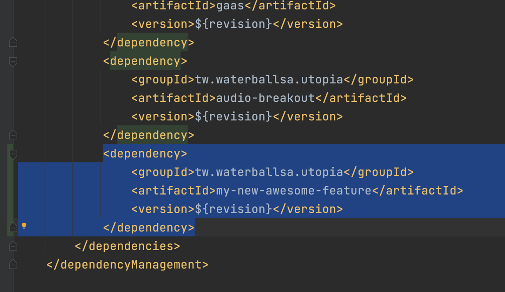
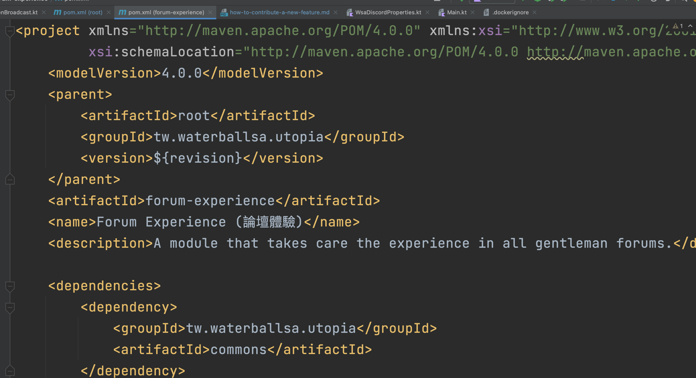

# How to contribute a new feature?

When you want to contribute a new feature to the project, you need to make sure that the feature is added to the correct
module. If you can't find the proper module to add the feature to, follow the steps below to create a new feature
module.

## Create a new feature module

To create a new feature module, follow these steps:

1. Create a new module using Maven. Make sure you have added the module name to the list of modules in the root pom
   file.
    1. Open your project in an IDE, such as IntelliJ IDEA.
    2. Right-click on the root directory of your project, and select "New" -> "Module".
    3. Choose "Maven" as the type of module you want to create, and click "Next".
    4. In the "Artifact Coordinates" dialog, enter the following details:
        - "GroupId": the identifier for your organization or group (e.g., "tw.waterballsa.utopia")
        - "ArtifactId": the identifier for your module (e.g., "my-new-awesome-feature")
        - "Version": the version of your module (e.g., "1.0-SNAPSHOT")
        - Leave the "Packaging" as "jar".
    5. Click "Next", and choose a directory where you want to create the module.
    6. Click "Finish" to create the module.
    7. Next, you will need to add the newly created module to the root pom file. Open the root pom file, and add the
       following code to the list of modules:

2. Declare your module's dependency in the dependency management section within the root pom file using the following
   code:

    ```xml
    <dependencyManagement>
        <dependencies>
            ....
            <dependency>
                <groupId>tw.waterballsa.utopia</groupId>
                <artifactId><!--your feature module's name--></artifactId>
                <version>${revision}</version>
            </dependency>
            ....
        </dependencies>
    </dependencyManagement>
    ```
    Replace `<!--your feature module's name-->` with the name of your new feature module.

    Example configuration in /pom.xml:
   

3. Modify your feature module's pom file using the following code:

    ```xml
    <parent>
        <artifactId>root</artifactId>
        <groupId>tw.waterballsa.utopia</groupId>
        <version>${revision}</version>
    </parent>

    <artifactId><!--your feature module's identifier--></artifactId>
    <name><!--your feature module's name--></name>
    <description><!--your feature module's description--></description>
    ```

    Replace `<!--your feature module's identifier/name/description-->` with the artifactId, name and description of your
    new feature module.
    
    

4. Add your module as a dependency in the 'main' module's pom file. To do this, add the following code to the
   dependencies
   section of the pom file:

    ```xml
    <dependency>
        <groupId>tw.waterballsa.utopia</groupId>
        <artifactId><!--your feature module's name--></artifactId>
    </dependency>
    ```

   Replace `<!--your feature module's name-->` with the name of your new feature module.

Now you have created a new feature module and linked it to the main module of the project. You can start implementing
your new feature in the new module you created.
